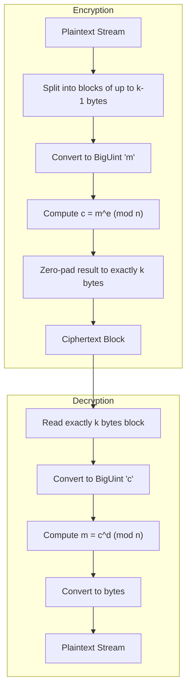

# Rust RSA

[](https://asciinema.org/a/P4LoC6ALlcKaUwct)

A minimalistic command-line tool implementing a **basic RSA encryption and decryption workflow**, written entirely in Rust. 

The primary goal of this project is **educational**—demonstrating the internal workings of the RSA algorithm, including:
- **RSA Key Generation**: Prime generation, primality testing, and modular arithmetic.
- **Block-Based Encryption**: Handling plaintext by dividing it into chunks.
- **Streaming File Processing**: Efficiently handling large files via streams.
- **Binary Ciphertext Format**: Reading and writing raw binary data safely.

> [!WARNING]
> **Not For Production Use.** This implementation is **not meant for real-world security**. It does **not implement modern padding schemes** (such as OAEP or PSS) and should only be used for learning, research, and experimentation purposes.

---

## Build & Installation

### Prerequisites
Make sure you have the Rust toolchain installed. If not, install it using [rustup](https://rustup.rs/).

### Clone and Build
1. Clone the repository:
   ```bash
   git clone https://github.com/usernob/rust-rsa.git
   cd rust-rsa
   ```
2. Build the project using Cargo:
   ```bash
   cargo build --release
   ```
   The compiled binary will be located at `target/release/rust-rsa`.

3. *(Optional)* Install the CLI globally on your system:
   ```bash
   cargo install --path .
   ```

---

## Usage Guide

The CLI provides three main subcommands: `keygen`, `encrypt`, and `decrypt`.

### 1. Key Generation
Generate a new RSA public and private keypair. The default key size is **1024 bits**.

```bash
rust-rsa keygen -o mykey
```
This will produce two files:
- `mykey.pub` - The Public Key (used for encryption)
- `mykey` - The Private Key (used for decryption)

To specify a custom key size (e.g., 4096 bits):
```bash
rust-rsa keygen -o mykey -b 4096
```

### 2. Encryption
Encrypt a plaintext file using the generated **public key**.

```bash
rust-rsa encrypt -k mykey.pub message.txt -o message.enc
```
* **`-k mykey.pub`**: The public key.
* **`message.txt`**: The plaintext input file (passed as positional argument).
* **`-o message.enc`**: The resulting encrypted binary output.

### 3. Decryption
Decrypt the ciphertext back to plaintext using the **private key**.

```bash
rust-rsa decrypt -k mykey message.enc -o message.txt
```

### 4. Unix Pipes Support
For seamless integration into shell scripts, the program fully supports UNIX pipes (`stdin` and `stdout`):

**Encrypt via Pipe:**
```bash
cat message.txt | rust-rsa encrypt -k mykey.pub > message.enc
```

**Decrypt via Pipe:**
```bash
cat message.enc | rust-rsa decrypt -k mykey > message.txt
```

---

## Under The Hood

### Ciphertext File Format
Ciphertext is stored as a continuous **binary stream of fixed-size RSA blocks**. Because ciphertext blocks always have a fixed size, the decryption process simply reads `k` bytes repeatedly until the end of the file.

The size of each ciphertext block (`k`) is determined by the size of the modulus `n`:
`k = ceil(bits(n) / 8)`

Note: In this implementation, the `-b` argument passed to the CLI specifies the bit-length of the primes `p` and `q`. The resulting modulus `n` will therefore have exactly double that bit length.

| CLI `-b` Argument | Modulus `n` Size | Block Size (k) | Max Plaintext Chunk |
| :--- | :--- | :--- | :--- |
| **512** | `1024 bits` | `128 bytes` | `127 bytes` |
| **1024** | `2048 bits` | `256 bytes` | `255 bytes` |
| **2048** | `4096 bits` | `512 bytes` | `511 bytes` |

### The Encryption & Decryption Flow



### RSA Core Mathematics
At its core, the RSA algorithm operates on two keys derived from prime numbers.
* **Public Key**: `(n, e)`
* **Private Key**: `(n, d)`

Where:
* `n = p × q` (Product of two large primes)
* `e = 65537` (Standard public exponent)
* `d` = Modular inverse of `e` modulo `φ(n)`

**Operations:**
* **Encryption**: $c = m^e \pmod{n}$
* **Decryption**: $m = c^d \pmod{n}$

---

## Limitations vs. Production Systems
This implementation intentionally keeps RSA simple and transparent for educational readability. Therefore, it lacks several critical features found in production cryptographic systems:

- **No OAEP Padding**: Susceptible to chosen-ciphertext attacks.
- **No Integrity Verification**: Ciphertext tampering cannot be easily detected.
- **No Hybrid Encryption**: Raw RSA is computationally heavy; real-world systems use RSA solely to exchange a symmetric key (e.g., AES), which is then used to encrypt the payload.

